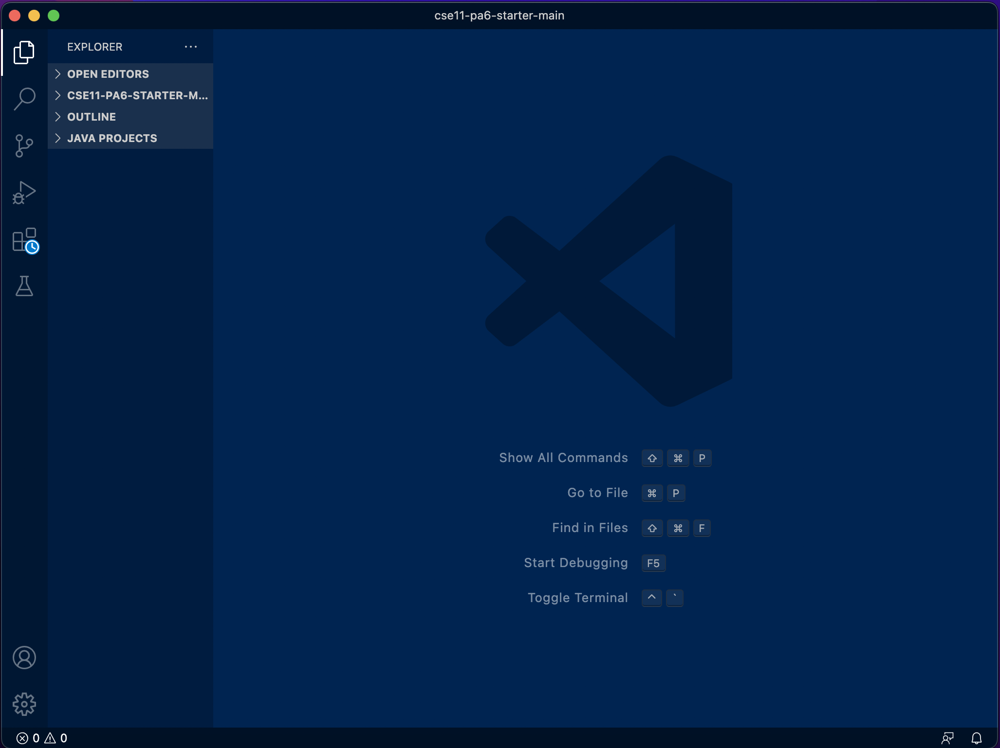
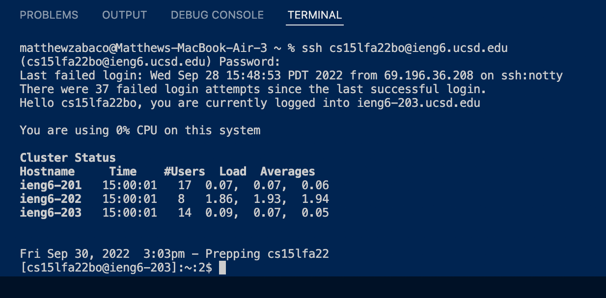
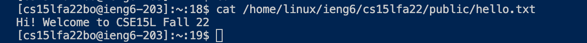
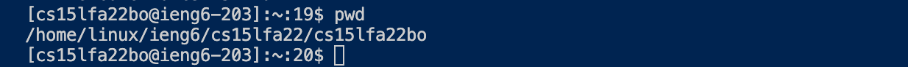
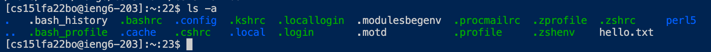
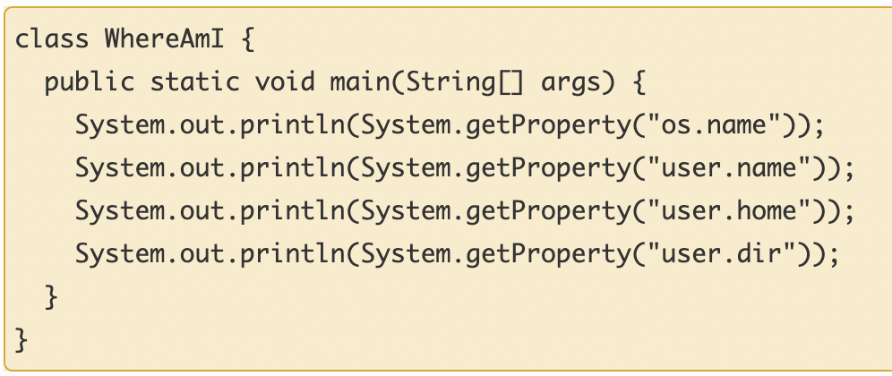
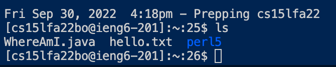
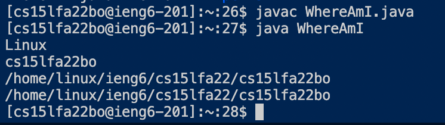

# Week 1 Lab Report
In this tutorial you will learn how I learned to log onto the UCSD remote super computers and how to complete Lab 1 for Cse 15L
## Installing VS Code
We need software in order to write software. For this tutorial we will be using an IDE called Visual Studio Code so make sure to have it installed.

> Steps to install:
> 1. Visit [https://code.visualstudio.com/Download](https://code.visualstudio.com/Download) (I already had it installed to my system)
> 2. Since I run MacOs I downloaded the mac downloader to get vscode set up
> 3. Now I have vs code yay!

Here is a picture of what my vs code looks like.

I really like blue!
## Remotely Connecting
Here I will show you how I connected to the super computers. I sort of struggled with this step because I was not able to change my password but I finally was able to do it and here is how.

1. The first step is I changed my password. 

> I struggled with this for no reason. If I had followed the instructions given I would have saved a lot of time. Use this link provided by the CSE15L staff: [How to reset you're password](https://docs.google.com/document/d/1hs7CyQeh-MdUfM9uv99i8tqfneos6Y8bDU0uhn1wqho/edit)

2. Opened up a terminal on vscode
3. Use `ssh` command to connect
> `ssh cs15lfa22bo@ieng6.ucsd.edu`
4. Entered my password. (the password does not demonstrate input, its almost like it is invisible) Then I clicked enter
5. Sweet log in sucessful

## Trying Some Commands
So up the here I was not able to actually try out any of the commands. I am in lab A01 on Wednesdays 2-4 class B260. My lab class was having trouble ssh properly due to not being able to correctly set our new passwords. I was finally able to get in at the end of lab but I had watched my group mates run some commands so lets walk through it right now. I am going to complete some commands in the terminal right now and show my outputs aswell as my thoughts.

> `cd ~`

This lets us switch between files in the computer.

> `cat /home/linux/ieng6/cs15lfa22/public/hello.txt`

Displays a nice message written by the CSE staff. How cute!

> `pwd`

Just a fun one I wanted to try out since it was in our key commands from lecture. Prints the current directory.

> `ls -a`

This lists a bunch of different things into our terminal. In lecture we learned that the `ls` command lists files and folders that our in the directory we are currently working in. Using pwd we learn our directory is `/home/linux/ieng6/cs15lfa22/cs15lfa22bo`

## Moving Files with `scp`
Lets try it right now!

1. I made a `WhereAmI.java` on my mac with the contents included from the Lab Tasks

2. I compiled my code `javac WhereAmI.java`
3. Ran my code `java WhereAmI`

Message that displays after running the file
4. Ran the `scp` command `scp WhereAmI.java cs15lfa22bo@ieng6.ucsd.edu:~/` in the directory where the java file is
5. Typed in my correct password
6. Logged back into remote computers with `ssh` to check if the file was present
7. Used the `ls` command to check on my file
8. It is there!

9. Ran the program on the remote computers

## SSH Keys