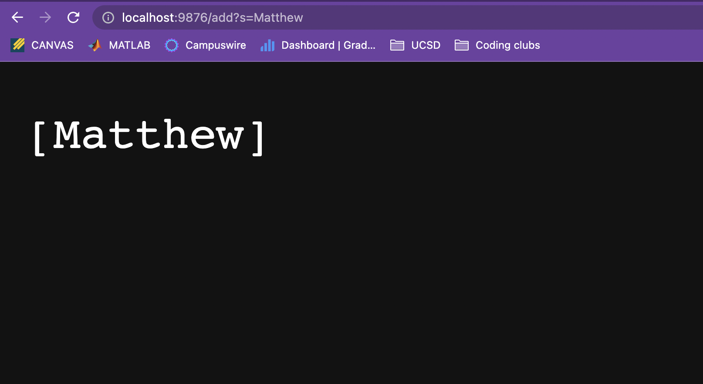
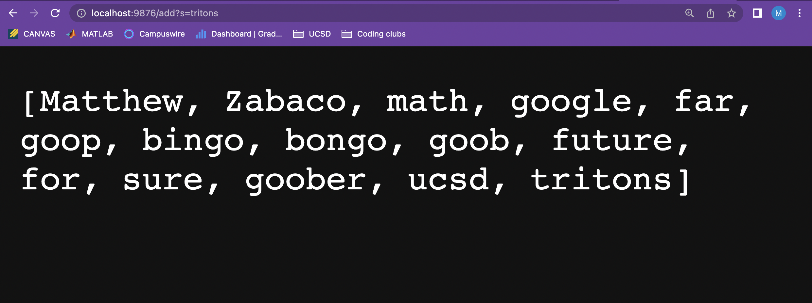
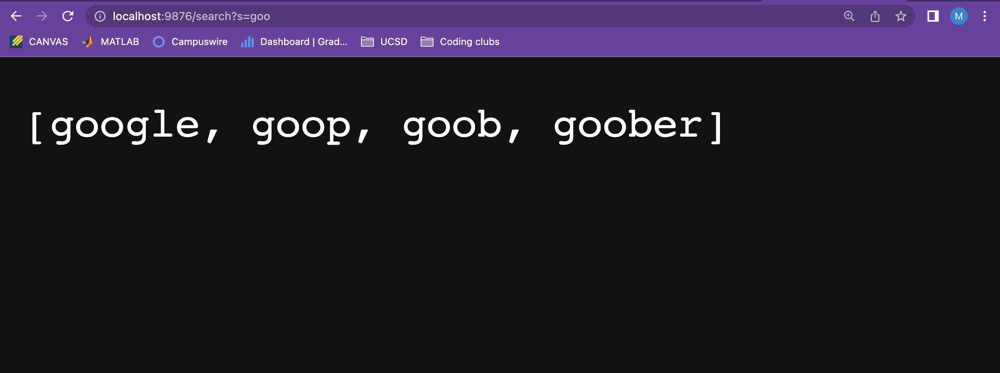
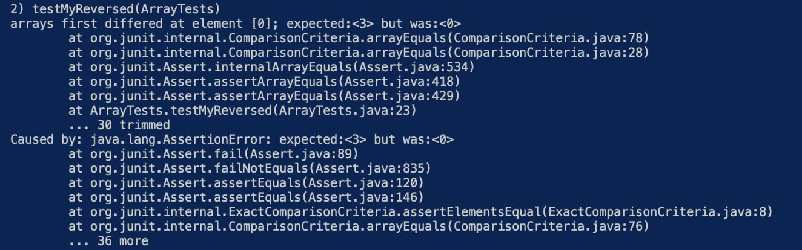
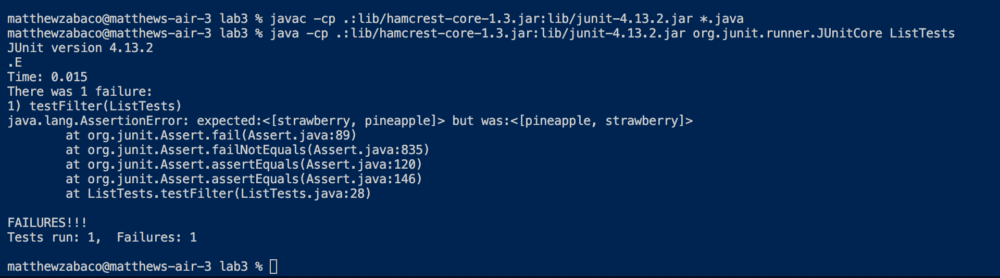

# Lab Report 2 - Week 3
## Part 1 - Simplest Search Engine
During lab we were tasked with creating a web server and then using the url to manipulate the webserver. We created a simple search engine. By typing `/add` into the url as the path of our server we could then include a query where we add words to our array. Then using `/search` we could query a string to search for any strings we added to our array. Here is my code!
```
import java.io.IOException;
import java.net.URI;
import java.util.ArrayList;
import java.util.Arrays;

class daHandler implements URLHandler {
    // Code copied and changed from NumberServer.java provided by CSE15l

    // Recieved help from Angela in my lab group
    
    int num = 0;
    ArrayList<String> sList = new ArrayList<>();

    public String handleRequest(URI url) {
        if (url.getPath().equals("/")) {
            return String.format("Number: %d", num);
        } 
        else if (url.getPath().equals("/search")) {
            // return "search works";
            String searchChar = url.getQuery().split("=")[1];
            ArrayList<String> output = new ArrayList<>();
            for(int i = 0; i < sList.size(); i++) {
                if(sList.get(i).contains(searchChar)) {
                    output.add(sList.get(i));
                }
            }
            return Arrays.toString(output.toArray());
        } 
        else {
            // System.out.println("Path: " + url.getPath());
            if (url.getPath().contains("/add")) {
                // return "add works";
                String[] parameters = url.getQuery().split("="); // My changes are below to the add method.
                // if (parameters[0].equals("s")) {
                     sList.add(parameters[1]);
                    return Arrays.toString(sList.toArray());
               // }
            }
            return "Error bro";
        }
    }
}

class SearchEngine {
    public static void main(String[] args) throws IOException {
        if(args.length == 0){
            System.out.println("Missing port number! Try any number between 1024 to 49151");
            return;
        }

        int port = Integer.parseInt(args[0]);

        Server.start(port, new daHandler());
    }
}
```
Pretty cool right!
Here you can see me using the add command to add in my name, Matthew.

The method being called in the code is the only method in `daHandler` class which is the `handleRequest` method. 

The `handleRequest` method goes into a if, else if, else statement. In the else statement the method checks if the url path contains `/add`. Since it does, the method splits the query by the `=` and stores the 2 split strings into a string array `parameters`. Using `parameters[1]` the method accesses the string argument. The string argument is then added to the array of strings `sList`. 
> `sList` is an array list of type `String` outside of the method that stores all of the strings we are going to add into our array and display on our website. 

Finally the method returns `sList` demonstrating the string array on my website and revealing the string I added, in this case my name.

So what changed?
* `sList` went from being empty to containing the string `Matthew`

Next I added a few more strings.

Here a similar request is being made to the one explained above since we are calling the `handleRequest` method again.

The same steps occur as explained above but the difference here is that `sList` is not empty, it has been filled with a bunch of other strings.

So what is changing?
* Again `sList` is changed. It now contains a new string at the end of the array, `tritons`

Finally I used to search to see what sorts of *goo*🦠 I had in my site.

Look at all that **goo**🦠🦠🦠

But in all seriousness we can see that I added lots of strings in my array that matched the search query `goo`

So what is going on here? We are actually still using the same `handleRequest` method, however, we are accessing a different part of the if, else if, else statements.

In the `else if` statement the method checks if the path of the url is equal to `/search` and it is. The url query is split and indexed at 1 to access the string arugment in the url. The string argument is set to the field `searchChar`. Now a new string array is created called `output`, this is where the strings the match our search will be added to. Next a for loop checks to see if each string element in `sList` contains the search string. If the string in `sList` contians the search string, then the string is stored into the new `output` array. Finally once the loop checks all of the strings in `sList`, the method returns `output` containing the strings that matched the search query.

So what changed?
* Well the else if statement created a new string array `output`
* The strings in `sList` that contained the search query `goo` were stored into `output`
* [googe, goop, goob, goober]
## Part 2
Here we were testing some code using J-unit and fixed bugs. I decided to fix the `reversed` method from `ArrayExamples.java` and the `filter` from `ListExample.java`

------

**Reversed**

The failure-inducing input I typed up was: 
```
@Test
  public void testMyReversed() {
    int[] input = {1, 2, 3};
    assertArrayEquals(new int[] {3, 2, 1}, ArrayExamples.reversed(input));
  }
  ```
Symptom:

The symptom is that the expected array and the actual array have different elements at the index 0. The test is expecting index 0 to be 3 but instead it was 0.

Bug fix:

From what I think the previous code for the `reversed` method had 2 bugs that caused the symptom to occur. First off the code was originally returning `arr` which was not the `newArray` that was created. Secondly the code was storying ints from `newArray` into `arr`. Since `newArray` was a new array that did not contain anything there was nothing to store into `arr`, and so `arr` stored 0 for all of its indicies. To change this I set `reversed` to return `newArray` and I switched the code in the for loop so that `arr` elements were being added to the `newArray` in reverse order.
```
  static int[] reversed(int[] arr) {
    int[] newArray = new int[arr.length];
    for(int i = 0; i < arr.length; i += 1) {
      newArray[arr.length - i - 1] = arr[i];
    }
    return newArray;
  }
  ```
Why did the symptom occur from bug?

 The `input` was an int array of {1,2,3}. I was expecting that it would return the reverse of the array which would have been {3,2,1}. But `reverse` was unable to do that becasue it was built wrong. Instead of adding elements in reverse order from the old array and storing them into a new array, it was storing elements from a new empty array into the old array. This overrided the input I had created and set all the values in the array to equal 0, {0, 0, 0}. That is why we see the elements differ at position 0. The test expected 3 but instead the actual value in `input` at position 0 was 0. 


-------
**Filter**

Wow this one was a struggle. The hardest part was just creating a test to even find the bug. I decided that I was going to test the filter method and find any bugs. I did not realize that I would not to implement a `checkString()` method in order to use `filter`. This is because `filter` takes in two parameters, `List<String>` and `StringChecker`
> `filter(List<String> list, StringChecker sc)`

Coding is not easy my friend but we are all learning. I spent a good amount of time trying to make this work. First I was having trouble because I was trying to make `checkString()` see if the `String` in the `list` contained another `String s`. 

It was me mad, until finally I realized that that is not the only thing that I could check in a string. I was focused on comparing to another `String` until I realized that I could simply check the size of the `String` using `.length()`. 

Still I ran into problems trying to use call `new checkString()` into my test. However, filter asks for a type `StringChecker`, so if `ListExamples` implements `StringChecker` I could create a new `ListExamples` and store it under the type `StringChecker`. Finally I had a working test!

Failure-Inducing Input:
```    @Test
    public void testFilter() {
        List<String> list = new ArrayList<>();
        list.add("apple");
        list.add("mango");
        list.add("fruit");
        list.add("strawberry");
        list.add("pineapple");
        list.add("grapes");

        StringChecker sc = new ListExamples();

        List<String> expected = new ArrayList<>(); // new String[] {"strawberry", "pineapple"}
        expected.add("strawberry");
        expected.add("pineapple");

        assertEquals(expected, ListExamples.filter(list, sc));
    }
```
Symptom:

If we check the output it shows that our `expected` and actual results carry the same String elements but at different indicies. The `filter` method says that String elements should be filtered into a new list in the same order. Time for debugging!

Bug:
The `filter` method was checking if each element in the list passed `true` for `checkString`. However the mistake was adding the string elements that passed to the new list at position 0, the front of the list. I changed the `filter` method by making sure Strings were added to the end of the list.

```  static List<String> filter(List<String> list, StringChecker sc) {
    List<String> result = new ArrayList<>();
    for(String s: list) {
      if(sc.checkString(s)) {
        result.add(s); // was result.add(0 , s);
      }
    }
    return result;
  }
  ```

Why did the symptom occur from the bug?

My `checkString` method ensures that strings are greater than length 6. My input list contained 6 different strings of fruit, however, only 2 of them contained lengths greater than 6, strawberry and pinapple. My test was expecting a new list containing [strawberry, pinapple] in that order since that was the order they were in the input  `list`. Instead the actual value returned [pineapple, strawberry] which meant that the Strings were being stored into the list incorrectly. They were being stored from the front of the list, instead of at the end of the list. Storing at the end of the list preserves the original order of the Strings.
