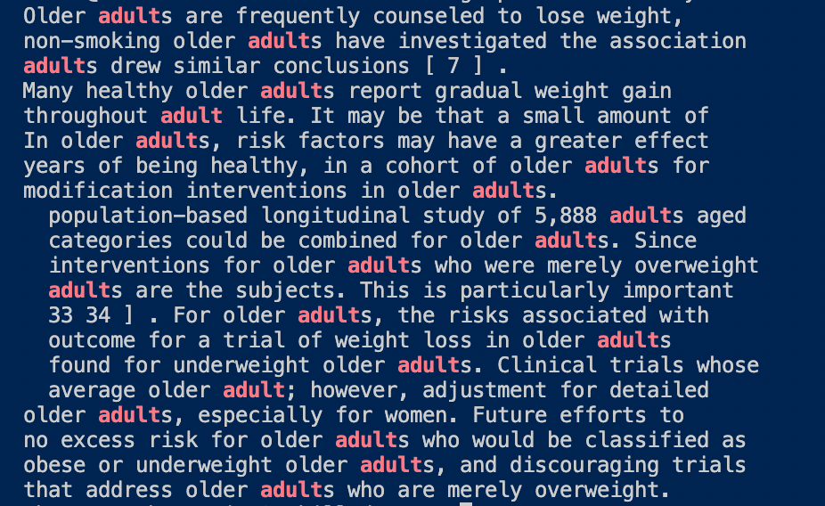
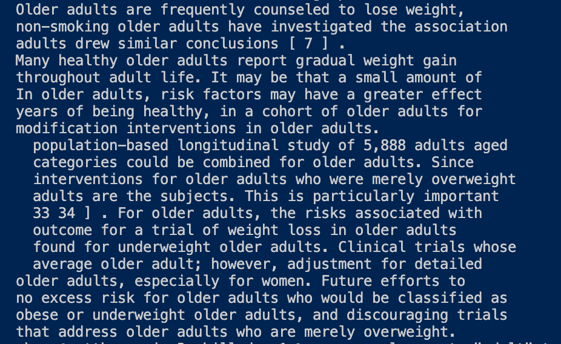
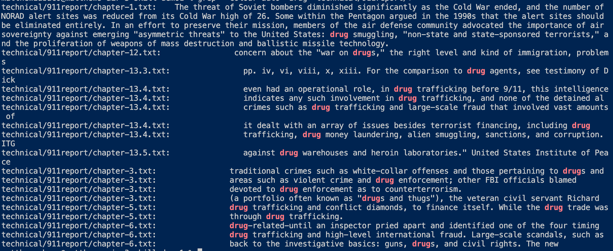
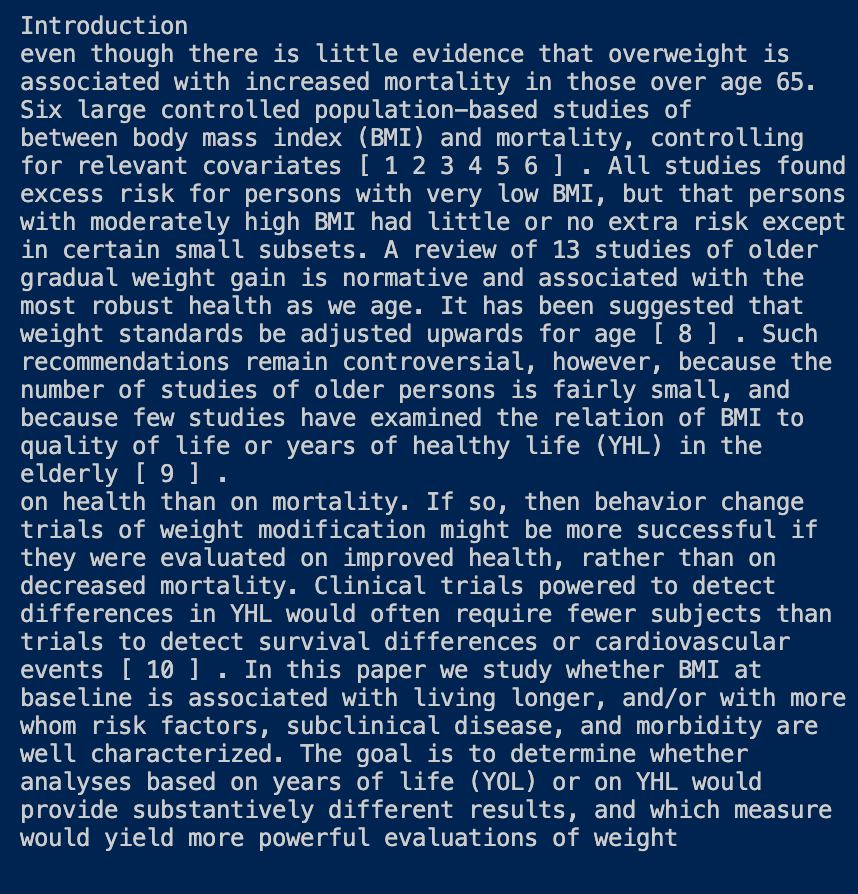

# Lab Report 3 - Week 5
## Examining `grep`
For this week's lab we are tasked with researching commands. I am choosing to research more about the `grep` command. I will be examing the following command-line options:

* `-c`, `--count`
* `--colour=[when]`
* `-v`, `--invert-match`

## `-c`, `--count`
The `-c` command serves like a count command. The command counts the lines that match the given input. 

**Example 1**

Input:
```
grep -c "adult" technical/biomed/1468-6708-3-1.txt
```
Output: 
```
20
```
The `-c` is counting the amount of lines in the file `technical/biomed/1468-6708-3-1.txt` that contain the word `adult`. This is useful for checking the amount of times a phrase is being used inside of a document.

**Example 2**

Input:
```
grep -c "adult" technical/biomed/*
```
Output: This output is very long so I am only including the last few lines of the output.
```
technical/biomed/gb-2003-4-2-r14.txt:0
technical/biomed/gb-2003-4-2-r16.txt:0
technical/biomed/gb-2003-4-2-r8.txt:12
technical/biomed/gb-2003-4-2-r9.txt:0
technical/biomed/gb-2003-4-3-r17.txt:17
technical/biomed/gb-2003-4-3-r18.txt:1
technical/biomed/gb-2003-4-3-r20.txt:0
technical/biomed/gb-2003-4-4-r24.txt:12
technical/biomed/gb-2003-4-4-r26.txt:3
technical/biomed/gb-2003-4-4-r28.txt:0
technical/biomed/gb-2003-4-5-r30.txt:0
technical/biomed/gb-2003-4-5-r32.txt:0
technical/biomed/gb-2003-4-5-r34.txt:0
technical/biomed/gb-2003-4-6-r37.txt:0
technical/biomed/gb-2003-4-6-r39.txt:0
technical/biomed/gb-2003-4-6-r41.txt:0
technical/biomed/gb-2003-4-7-r42.txt:4
technical/biomed/gb-2003-4-7-r43.txt:0
technical/biomed/gb-2003-4-7-r46.txt:0
technical/biomed/gb-2003-4-8-r50.txt:0
technical/biomed/gb-2003-4-8-r51.txt:0
technical/biomed/gb-2003-4-9-r57.txt:0
technical/biomed/gb-2003-4-9-r58.txt:0
technical/biomed/gb-2003-4-9-r60.txt:0
technical/biomed/rr166.txt:0
technical/biomed/rr167.txt:0
technical/biomed/rr171.txt:0
technical/biomed/rr172.txt:0
technical/biomed/rr191.txt:0
technical/biomed/rr196.txt:1
technical/biomed/rr37.txt:13
technical/biomed/rr73.txt:0
technical/biomed/rr74.txt:1
```
Here `-c` counts the lines that contain `adult` in all of the files inside of the `biomed` directory and list the counts beside the files. The star at the end of `technical/biomed/*` expands `-c` through all of the files in `biomed`. This is useful for quickly checking how many times a phrase is used across multiple files.

**Example 3**

Input: 
```
grep -c "gun" technical/911report/*
```
Output:
```
technical/911report/chapter-1.txt:6
technical/911report/chapter-10.txt:3
technical/911report/chapter-11.txt:0
technical/911report/chapter-12.txt:3
technical/911report/chapter-13.1.txt:0
technical/911report/chapter-13.2.txt:7
technical/911report/chapter-13.3.txt:2
technical/911report/chapter-13.4.txt:10
technical/911report/chapter-13.5.txt:3
technical/911report/chapter-2.txt:3
technical/911report/chapter-3.txt:4
technical/911report/chapter-5.txt:0
technical/911report/chapter-6.txt:4
technical/911report/chapter-7.txt:2
technical/911report/chapter-8.txt:3
technical/911report/chapter-9.txt:3
technical/911report/preface.txt:0
```
The `-c` command counts the lines using gun in the files in `911report`. Useful for quickly checking which reports involve a gun.

## `--colour=[when]`
The colour command colours text that mathes the input. The values of `when` are `never`, `always`, and `auto`.

**Example 1**

Input:
```
grep --colour=always "adult" technical/biomed/1468-6708-3-1.txt
```
Output:


Since adult is being grepped it is colored red in the ouput lines. This is useful so that you can easily find where your grepped word is in the output. Replacing `always` with `auto` produces the same output

**Example 2**

Input:
```
grep --colour=never "adult" technical/biomed/1468-6708-3-1.txt
```
Output:


This command just searches for the term adults but instead does not color it in. I am not sure why this command ise useful as it is just the same as a normal grep output.

**Example 3**

Input:
```
grep --colour=auto "drug" technical/911report/*
```
Output:


The command displays which files contain "drug", displaying the line and coloring in where the word was found. This is useful for searching a word across multiple files and seeing where the word is or how it is being used. I can quickly obtain context over what is going on in these drug related 911 reports.


## `-v`, `--invert-match`
This does the opposite of `grep`. Instead of matching input given by the user, it matches lines that do not do not match with the input. Thus an inverse match. 

**Example 1**

Input:
```
grep -v "adult" technical/biomed/1468-6708-3-1.txt
```
Output: Output is long so including only the first few lines of output


The command includes all of the lines that do not include the word "adult". Useful to see which lines do not include the word adult.

**Example 2**

Input:
```
grep -v -c "measure" technical/biomed/1468-6708-3-1.txt
```
Output:
```
415
```
Here the command is looking through `technical/biomed/1468-6708-3-1.txt` and counting the lines that do not contain the word `measure`. This can be useful for seeing how many of your lines of a file do not use a certain word or phrase.

**Example 3**

Input: 
```
grep -v -c "the" technical/911report/*
```
Output:
```
technical/911report/chapter-1.txt:418
technical/911report/chapter-10.txt:267
technical/911report/chapter-11.txt:284
technical/911report/chapter-12.txt:735
technical/911report/chapter-13.1.txt:446
technical/911report/chapter-13.2.txt:769
technical/911report/chapter-13.3.txt:1079
technical/911report/chapter-13.4.txt:1871
technical/911report/chapter-13.5.txt:1802
technical/911report/chapter-2.txt:422
technical/911report/chapter-3.txt:1328
technical/911report/chapter-5.txt:569
technical/911report/chapter-6.txt:852
technical/911report/chapter-7.txt:718
technical/911report/chapter-8.txt:414
technical/911report/chapter-9.txt:690
technical/911report/preface.txt:40
```
Here the command expands through `911report` and finds the amount of lines in each text file that do not contain the word "the". This can be useful to see what lines do not contain a word acrosss multiple files.
