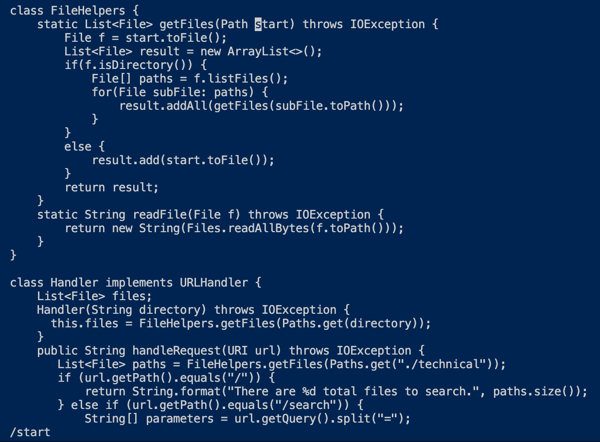
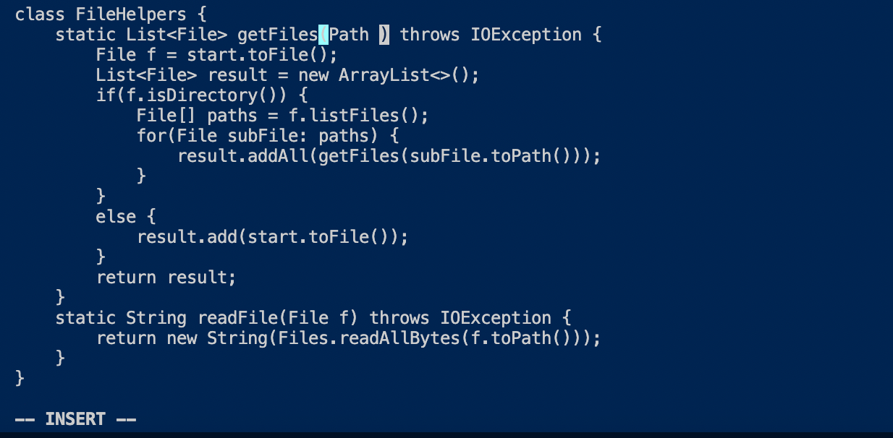
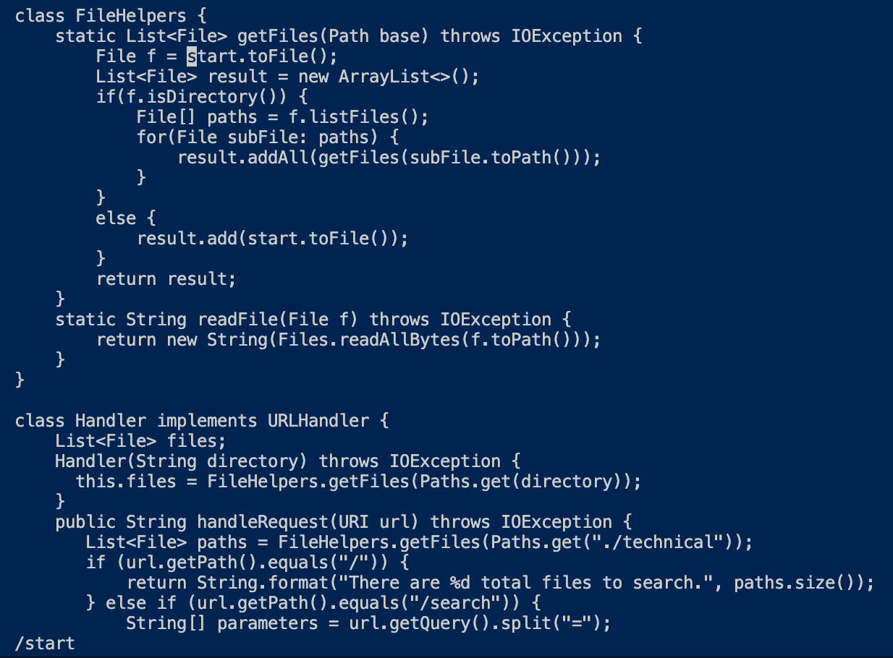
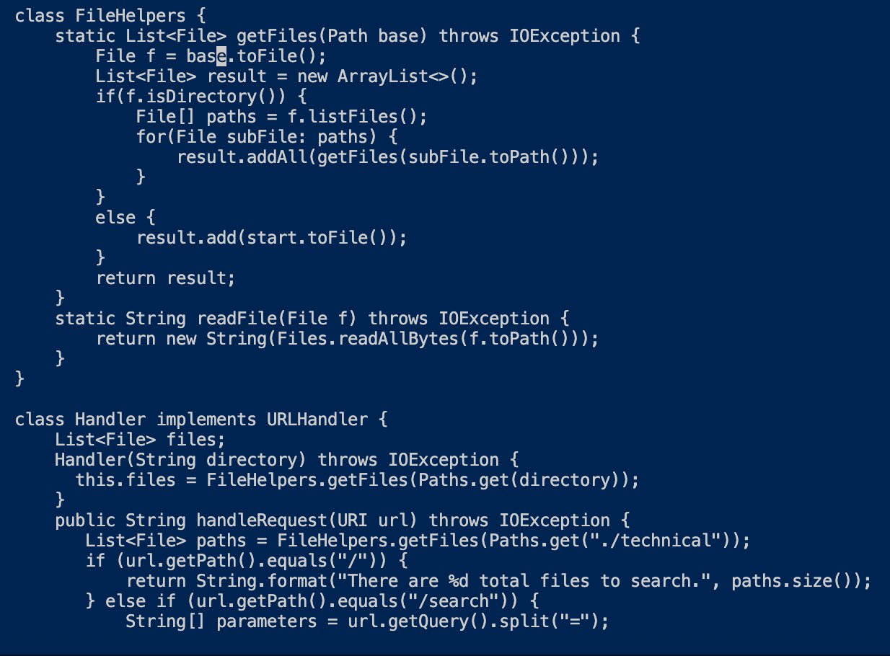
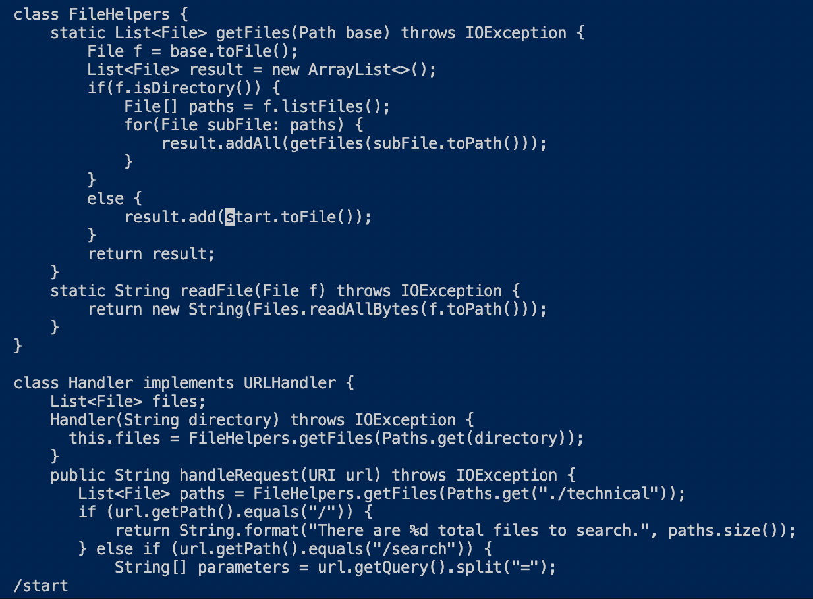
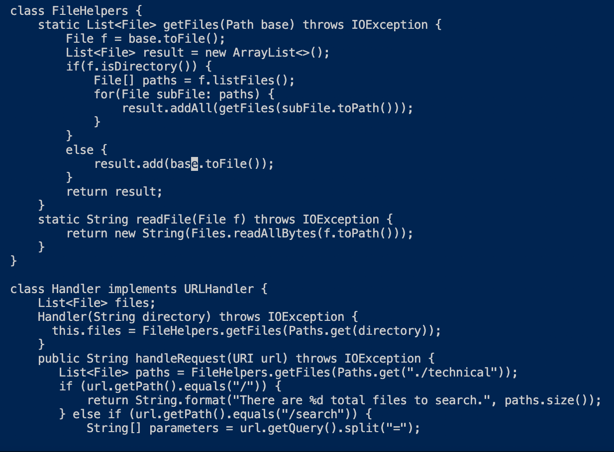

# Lab Report 4 - Week 7
Learning how to use vim!
## Part 1
In lab last week we were given the task to: 
* In `DocSearchServer.java`, change the name of the `start` parameter of `getFiles`, and all of its uses, to instead be called `base`.

For vim this task becomes much easier than searching for code like you normalled would with a mouse and keyboard. 

My group decided that the fastest way to accomplish the tasks with vim was to use the following key presses:
>`/start<Enter>cebase<Esc>n.n.:wq`

`/start<Enter>` 

Finds occurances of start in our code starting from the top. `/` works as the search command to find things in code, right now we are searching for start. `<Enter>` ends our query after typing `/`.

`ce` 

`c` stands for change command which will change elements, `e` command taks us to the end of a sequence of characters. `ce` changes characters up to where `e` lands. In this case start gets changed.

`base<Esc>`

The previous `c` command enters us into insert mode so when we type in `base` it acts as if typing it directly into the code. The `<Esc>` takes us out of insert mode.

`n`

`n` command takes us to the next occurance of where find occurs.

`.`

The `c` change command gets saved similar to when you copy something on your computer. By pressing `.` you are pasting the previous change you made eariler. By using `n` and `.` we can find all the other cases of `start` in `getFiles` and change them to `base`.

`:wq`

This command servers as a save and quit. `:` allows you to chain commands together in vim. `w` is the save command. `q` is the quit command.

## Part 2

