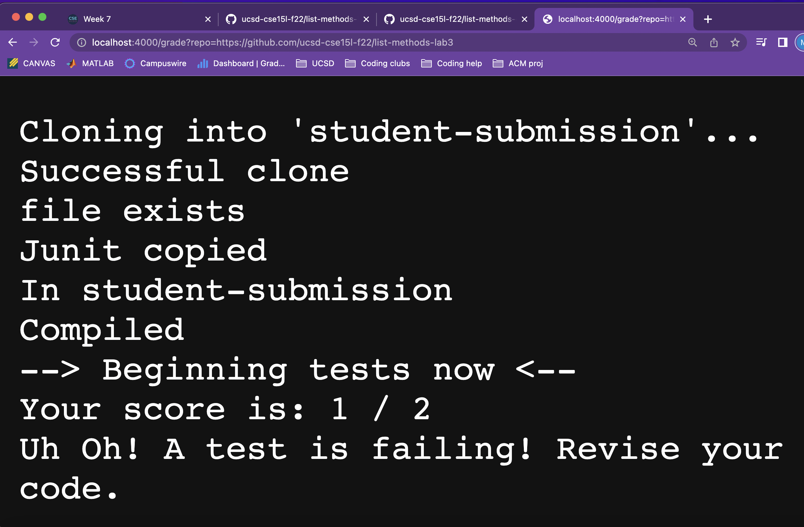
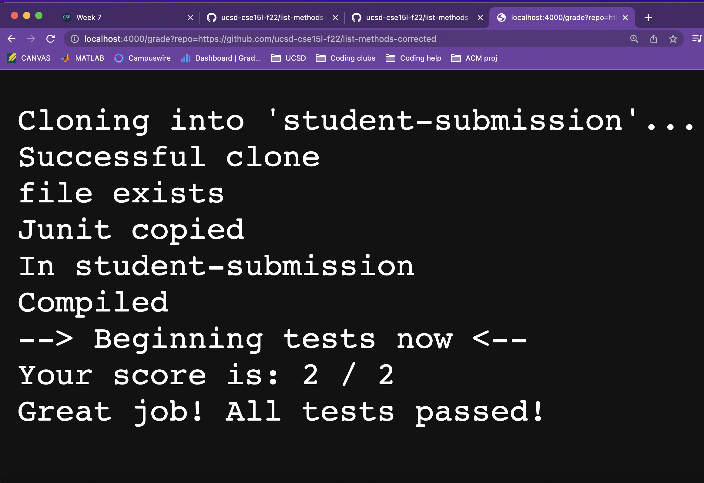
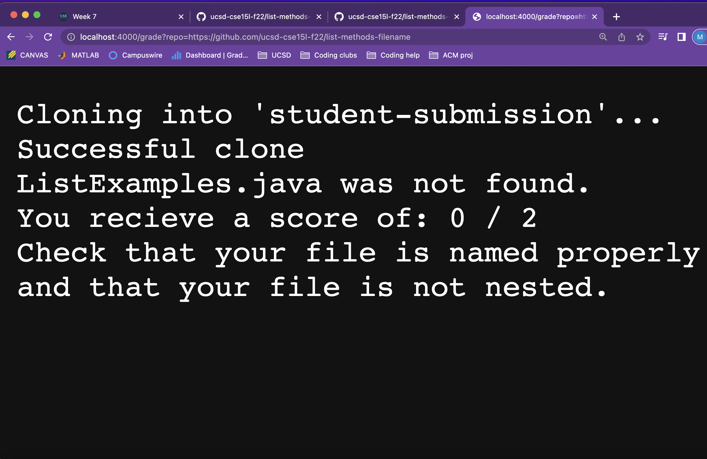

# Lab Report 5 - Week 9
For this week's lab report we were given the task of creating a grading script. This is similar to the autograder scripts that run on gradescrope for other courses such as cse12 so it was cool learning how to create our very own autograders. Creating the grading script was actually pretty challenging and called up learning lots of new ways to use different command line tools such as `grep`,learning `if` statements in bash, and also learning how to create and use variables. It was cool to see the behind the scenes that goes down in those gradescope autograders that grade our code.

## Grading Script
In lab 7 we were tasked to work with a partner to create a grading script. I worked together with Sherif Elfiky to come up with our grading script.
```
JU=".:lib/hamcrest-core-1.3.jar:lib/junit-4.13.2.jar"

rm -rf student-submission
git clone $1 student-submission

echo "Successful clone"

FILE=student-submission/ListExamples.java

if  [ -f "$FILE" ]; then
    echo "file exists"
else
    echo "ListExamples.java was not found."
    echo "You recieve a score of: 0 / 2"
    echo "Check that your file is named properly and that your file is not nested."
    exit 1
fi

cp -r lib student-submission
echo "Junit copied"

cp TestListExamples.java student-submission/
cd student-submission
echo "In student-submission"

# Score of the tests. Starts at value 0 and increases
# when qualifications are met.
# out of 2
SCORE=0

javac -cp $JU *.java 2> CompileErr.txt
if [[ $? -ne 0 ]]; then
    echo "Your code did not compile. You recieve a $SCORE / 2"
    exit 1
fi
echo "Compiled"

echo "--> Beginning tests now <--"

java -cp $JU org.junit.runner.JUnitCore TestListExamples > JunitOut.txt

grep -q "2 tests" JunitOut.txt
if [[ $? -eq 0 ]]; then
    SCORE=2
fi
grep -q "Failures: 1" JunitOut.txt
if [[ $? -eq 0 ]]; then
    SCORE=1
fi


echo "Your score is: $SCORE / 2"
if [[ $SCORE -eq 2 ]]; then
    echo "Great job! All tests passed!"
fi
if [[ $SCORE -eq 1 ]]; then
    echo "Uh Oh! A test is failing! Revise your code."
fi
```

## Screenshots on Local Server
Repository: https://github.com/ucsd-cse15l-f22/list-methods-lab3


Repository: https://github.com/ucsd-cse15l-f22/list-methods-corrected


Repository: https://github.com/ucsd-cse15l-f22/list-methods-filename


## Tracing the grading script
For this trace we will be tracing the following student submission, https://github.com/ucsd-cse15l-f22/list-methods-corrected , which recieved a score of 2/2. A full score! 
> In the trace I will be talking about standard output and standard error of commands. I will be using the abbreviations `stdout` for standard output and `stderr` for standard error. If *None* is written for either it means that nothing was produced.

-------
```
JU=".:lib/hamcrest-core-1.3.jar:lib/junit-4.13.2.jar"
```
Sets Junit to a variable JU making it easier to call later.
* `stdout` : *None*
* `stderr` : *None*
* Return Code: 0
```
rm -rf student-submission
```
This line removes the previous student-submission.
* `stdout` : *None*
* `stderr` : *None*
* Return Code: 0
```
git clone $1 student-submission
```
This clones the student submission that we will test for our grades script to a directory called student-submission.
* `stdout` : Cloning into 'student-submission' ...
* `stderr` : *None*
* Return Code: 0
```
echo "Successful clone"
```
Serves as a message to let us now that the repo was properly cloned.
* `stdout` : Successful Clone
* `stderr` : *None*
* Return Code: 0
```
FILE=student-submission/ListExamples.java
```
Sets the file path to a variable called `FILE` making it easier to call in later commands.
* `stdout` : *None*
* `stderr` : *None*
* Return Code: 0
```
if  [ -f "$FILE" ]; then
```
Here we have an if statement that checks for the students ListExamples.java file. `-f` returns true if the file exists. The condition returns true because ListExamples.java exists inside of the student-submission directory.
```
    echo "file exists"
```
Prints a message after the if statement returns true to let us know that the ListExamples.java file exists.
* `stdout`: file exists
* `stderr`: *None*
* Return Code: 0
```
else
    echo "ListExamples.java was not found."
    echo "You recieve a score of: 0 / 2"
    echo "Check that your file is named properly and that your file is not nested."
    exit 1
```
The following lines do not run becasue the condition of the if statement returned true.
```
fi
```
Just signals the end of our if statement from above.
```
cp -r lib student-submission
```
Copies Junit files into the student-submission directory.
* `stdout` : *None*
* `stderr` : *None*
* Return Code: 0
```
echo "Junit copied"
```
Message displaying Junit was succesfully copied.
* `stdout` : Junit copied
* `stderr` : *None*
* Return Code: 0
```
cp TestListExamples.java student-submission/
```
Copies the tests I made into the student-submission directory.
* `stdout` : *None*
* `stderr` : *None*
* Return Code: 0
```
cd student-submission
```
Enters into the student-submission directory.
* `stdout` : *None*
* `stderr` : *None*
* Return Code: 0
```
echo "In student-submission"
```
Message to let us know the directory we are in.
* `stdout` : In student-submission
* `stderr` : *None*
* Return code: 0
```
SCORE=0
```
Creating a score vairable that will be manipulated to display the grade of the student's code.
* `stdout` : *None*
* `stderr` : *None*
* Return Code: 0
```
javac -cp $JU *.java 2> CompileErr.txt
```
Compiles the student code and Junit. Standard error is redirected to a file called CompileErr.txt
* `stdout` : *None*
* `stderr` : *None*
* Return Code: 0
```
if [[ $? -ne 0 ]]; then
```
The condition checks if the following command had a return code that is not equal to 0, meaning an error occured. Since the student's code compiled, the return code was 0, meaning that this condition returns false.
```
    echo "Your code did not compile. You recieve a $SCORE / 2"
    exit 1
```
The following code does not run because the condition in the if statement returned false.
```
echo "Compiled"
```
* `stdout` : Compiled
* `stderr` : *None*
* Return Code: 0
```
echo "--> Beginning tests now <--"
```
* `stdout`: --> Beginning tests now <--
* `stderr` : *None*
* Return Code: 0
```
java -cp $JU org.junit.runner.JUnitCore TestListExamples > JunitOut.txt
```
This command runs our tests on the student's code. It uses our JU variable that we set previously. The `stdout` is saved to JunitOut.txt so that we can properly score the students code by using the output of the command.
* `stdout` : 
```
JUnit version 4.13.2
..
Time: 0.015

OK (2 tests)


```
* `stderr` : *None*
* Return Code: 0
```
grep -q "2 tests" JunitOut.txt
```
Checks to see if "2 tests" exists in `JunitOut.txt`. "2 tests" is stored in the text file when both the tests pass.
* `stdout` : *None*
* `stderr` : *None*
* Return Code: 0
```
if [[ $? -eq 0 ]]; then
```
The condition returns true. The condition returns true because it is checking the return code of the last called command. Since "2 tests" does exist in JunitOut.txt then the return code was as 0.
```
    SCORE=2
```
Sets the SCORE variable to 2 for passing all of the tests.
* `stdout` : *None*
* `stderr` : *None*
* Return Code: 0
```
grep -q "Failures: 1" JunitOut.txt
```
Checks to see if "Failures: 1" exists in `JunitOut.txt`. If "Failures: 1" is stored in the text file that means one of the tests failed.
* `stdout` : *None*
* `stderr` : *None*
* Return Code: 1
```
if [[ $? -eq 0 ]]; then
```
The condition returns false because The last command run has a return code of 1.
```
    SCORE=1
```
This code does not run since the condition in the if statement returned false.
```
echo "Your score is: $SCORE / 2"
```
Returns the score of the student using the variable we created.
* `stdout` : Your score is: 2 / 2
* `stderr` : *None*
* Return Code: 0
```
if [[ $SCORE -eq 2 ]]; then
```
The condition returns true because the value contained in `SCORE` is 2.
```
    echo "Great job! All tests passed!"
```
* `stdout` : Great job! All tests passed!
* `stderr` : *None*
* Return Code: 0
```
if [[ $SCORE -eq 1 ]]; then
```
The condition returns false because the value contained in `SCORE` is 1.
```
    echo "Uh Oh! A test is failing! Revise your code."
```
This line does not run because the condition of the if statement returned false.